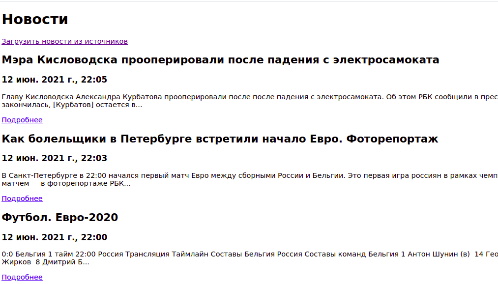
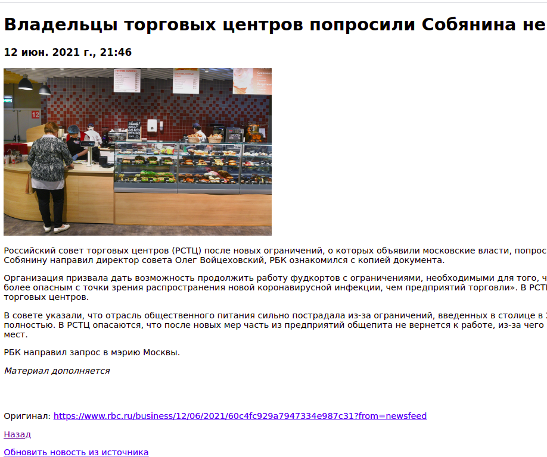

# newsreader
News Reader


```sh
$ symfony server:start -d 
$ symfony composer install
$ docker-compose up -d
$ symfony console doctrine:migrations:migrate
```

## Tests

```sh
$ symfony php bin/phpunit
```

```
// Get news list from source:
$this->newsParser->parseSource($source);

// Get single news:
$this->newsParser->parseNews($news);
```


## Web

https://127.0.0.1:8000/

https://127.0.0.1:8000/admin

## Screenshots




